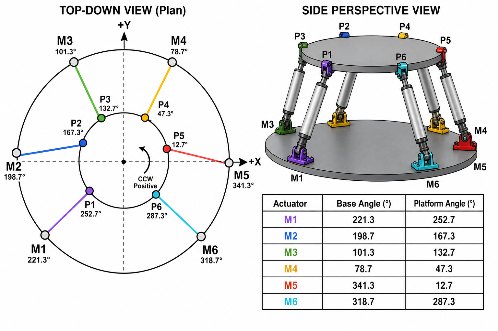
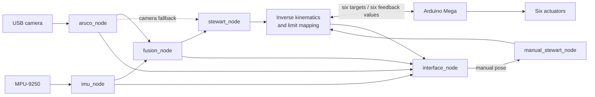

# Autonomous Coupling — Stewart Control

> ROS 2 control, perception, and operator software for a six-actuator Stewart
> platform used in autonomous alignment and coupling experiments.

[](https://docs.ros.org/en/jazzy/)
[](https://www.python.org/)
[](LICENSE)

Autonomous Coupling combines ArUco vision, MPU-9250 inertial sensing, sensor
fusion, inverse kinematics, actuator calibration, and an Arduino motor
controller in one ROS 2 workspace. A PySide6 dashboard gives the operator live
telemetry and access to acquisition, automatic, manual, initial-position, and
recovery workflows.

> [!CAUTION]
> This repository controls physical machinery. Calibrate and test one actuator
> at a time before installing all six, keep an emergency stop accessible, and
> never work inside the platform's motion envelope while power is applied.

## Documentation

| Document | Audience | Purpose |
|---|---|---|
| **[User Manual](USER_MANUAL.md)** | Operators and commissioning engineers | Complete installation, calibration, startup, operation, shutdown, and troubleshooting procedure. |

## What the system does

- Detects a configured ArUco marker with a calibrated USB camera.
- Reads calibrated orientation and angular rate from an MPU-9250 over I2C.
- Fuses camera, IMU, and gyroscope data with per-axis Kalman filters.
- Converts a requested six-degree-of-freedom pose into six actuator lengths.
- Maps logical movement to independently calibrated actuator travel limits.
- Sends six comma-separated targets to an Arduino Mega and reads encoder
  feedback over serial.
- Provides live sensor, fusion, command, feedback, and camera monitoring.
- Blocks automatic and manual motion after an unclean shutdown until the home
  position has been recovered and confirmed.

## Reference platform

| Component | Reference configuration |
|---|---|
| Host | Raspberry Pi or Linux workstation, Ubuntu 24.04 |
| Middleware | ROS 2 Jazzy |
| Runtime | Python 3.12 |
| Vision | USB/V4L2 camera, 640 × 480 at 30 FPS requested |
| Target | ArUco `DICT_4X4_1000`, moving marker ID `26`, 22 mm marker size |
| Inertial sensor | MPU-9250, I2C bus `1`, address `0x68` |
| Motor controller | Arduino Mega 2560, `/dev/ttyACM0`, 115200 baud |
| Mechanism | Six encoded actuators, individually calibrated for 0–10 cm logical travel |
| Interface | PySide6 and Matplotlib |

These are the checked-in defaults, not universal hardware requirements. Adapt
[`stewart_params.yaml`](src/stewart_control/config/stewart_params.yaml) to the
physical installation before enabling motion.



## Architecture



### ROS 2 nodes

| Executable | Responsibility |
|---|---|
| `aruco_node` | Camera acquisition, marker detection, pose referencing, smoothing, and preview publishing. |
| `imu_node` | MPU-9250 acquisition, calibration, axis remapping, home-reference correction, and gyro publishing. |
| `fusion_node` | Per-axis angle/rate Kalman fusion with stale-data and camera-outlier handling. |
| `stewart_node` | Automatic pose selection, filtering, inverse kinematics, safety limits, and serial control. |
| `manual_stewart_node` | Applies operator pose commands through the same kinematics and actuator limits. |
| `posHome_node` | Drives and verifies the configured home position during recovery. |
| `interface_node` | Operator dashboard and ROS process management. |
| `motor_test_interface` | Individual actuator test, homing, and min/max calibration tool. |

### Principal topics

| Topic | Type | Payload |
|---|---|---|
| `/aruco_position` | `Float32MultiArray` | Referenced marker `[x, y, z]` in metres. |
| `/aruco_orientation` | `Float32MultiArray` | Marker `[roll, pitch, yaw]` in degrees. |
| `/camera/image_raw` | `sensor_msgs/Image` | Annotated operator preview. |
| `/imu_error` | `Float32MultiArray` | Corrected IMU orientation in degrees. |
| `/imu_gyro` | `Float32MultiArray` | Angular rate in degrees per second by default. |
| `/F_orientation` | `Float32MultiArray` | Fused orientation in degrees. |
| `/F_position` | `Float32MultiArray` | Fresh camera position forwarded by fusion. |
| `/F_pose` | `Float32MultiArray` | Fused `[x, y, z, roll, pitch, yaw]`. |
| `/manual_position` | `Float32MultiArray` | Manual translation command in centimetres. |
| `/manual_orientation` | `Float32MultiArray` | Manual angular command in degrees. |
| `/stewart/longueurs` | `Float32MultiArray` | Six actuator command targets in centimetres. |
| `/feedback_motors` | `Float32MultiArray` | Six measured actuator positions in centimetres. |
| `/stewart_status` | `String` | Runtime and actuator-limit status. |

## Operating modes

| Mode | Launch path | Motor output |
|---|---|---:|
| Acquisition | `acquisition_launch.py` | No |
| Automatic | Acquisition stack + `stewart.launch.py` | Yes |
| Manual | `manual_launch.py` | Yes |
| Initial position | Zero pose sent through manual control | Yes |
| Recovery / homing | `launch_posHome.py` or the recovery window | Yes |
| Combined headless | `stewart_ordered_launch.py` | Yes |

The dashboard starts and stops the required launch processes. Only one motion
mode should own the serial port at a time.

## Quick start

The full commissioning procedure is in [USER_MANUAL.md](USER_MANUAL.md). On an already
configured host and calibrated platform, the normal workflow is:

```bash
cd Autonomous-Coupling
source /opt/ros/jazzy/setup.bash
colcon build --symlink-install --packages-select stewart_control
source install/setup.bash
ros2 run stewart_control interface_node
```

In the dashboard:

1. Resolve any **Recovery required** state while the platform is physically at
   home.
2. Select **Acquisition** and confirm camera, ArUco, IMU, and fusion telemetry.
3. Use **Manual** for low-risk commissioning or **Automatique** for closed-loop
   alignment.
4. Select **État initial**, verify all feedback values return to home, then stop
   the ROS processes and close the application.

For a headless automatic launch:

```bash
source /opt/ros/jazzy/setup.bash
source install/setup.bash
ros2 launch stewart_control stewart_ordered_launch.py
```

## Installation summary

Install ROS 2 Jazzy and the runtime dependencies used by the package:

```bash
sudo apt update
sudo apt install python3-colcon-common-extensions python3-pip python3-smbus i2c-tools
sudo apt install ros-jazzy-cv-bridge ros-jazzy-rclpy ros-jazzy-sensor-msgs ros-jazzy-std-msgs
python3 -m pip install --user numpy pyyaml pyserial PySide6 matplotlib opencv-contrib-python imusensor
```

See the [user manual](USER_MANUAL.md#2-prepare-the-host) for the complete setup.

## Configuration

The source-of-truth configuration is:

```text
src/stewart_control/config/stewart_params.yaml
```

The loader resolves a configuration file in this order:

1. The path in `STEWART_CONFIG`.
2. The configuration beside the source package.
3. The configuration installed by `colcon`.

| Section | Controls |
|---|---|
| `stewart_platform` | Base/platform geometry, home pose, nominal leg lengths. |
| `serial` | Device, baud rate, timeout, and startup delay. |
| `actuators` | Logical range, per-motor limits, home vector, and update thresholds. |
| `aruco` | Camera settings, dictionary, marker IDs/size, reference pose, and smoothing. |
| `imu` | Bus/address, calibration file, reference orientation, remap, and rate. |
| `fusion` | Sensor timeouts, Kalman noise, outlier recovery, and output deadband. |
| `automatic_control` | Pose source, command filtering, stop tolerance, and blind approach. |

To use a machine-specific configuration without changing the repository:

```bash
export STEWART_CONFIG=/absolute/path/to/stewart_params.yaml
```

## Safety model

The control nodes persist position trust in:

```text
~/.stewart_control/motor_runtime_state.json
```

Set `STEWART_RUNTIME_DIR` to relocate that file. A new installation, interrupted
motion process, failed park operation, or unclean shutdown requires recovery.
Automatic and manual control remain disabled until a trusted home is confirmed.

`automatic_control.bypass_runtime_state` exists for development but disables an
important interlock and should remain `false` on hardware.

## Calibration and diagnostics

| Task | Command |
|---|---|
| Camera calibration | `python3 src/stewart_control/calibration/calibrate_camera_charuco.py` |
| Camera validation | `python3 src/stewart_control/validation/validate_camera_calibration.py` |
| IMU calibration | `python3 src/stewart_control/calibration/calibrate_dual_imu.py` |
| IMU reference check | `python3 src/stewart_control/test/test_imu_home_reference.py` |
| Camera feed check | `python3 src/stewart_control/test/test_camera_feed.py` |
| Marker ID check | `python3 src/stewart_control/test/test_detect_aruco_ids.py` |
| Sensor reference verification | `python3 scripts/verify_sensor_calibration.py` |
| Runtime performance capture | `python3 scripts/performance_monitor.py --duration 120` |

Files under `src/stewart_control/test/` are interactive hardware diagnostics,
not a conventional automated unit-test suite.

## Repository structure

```text
Autonomous-Coupling/
├── README.md                         Project overview and technical reference
├── USER_MANUAL.md                    End-to-end user manual
├── scripts/                          Runtime verification and monitoring
├── images/                           Documentation assets
└── src/stewart_control/
    ├── arduino/                      Production Arduino firmware
    ├── assets/                       GUI assets
    ├── calibration/                  Camera and IMU calibration tools
    ├── config/stewart_params.yaml    Central configuration
    ├── launch/                       ROS 2 launch descriptions
    ├── share/stewart_control/        Calibration artifacts
    ├── stewart_control/              Python package and ROS nodes
    ├── test/                          Interactive hardware diagnostics
    └── validation/                    Calibration validation tools
```

`build/`, `install/`, and `log/` are generated by `colcon`; do not edit them.

## Development

After changing Python, configuration, launch, or package data, rebuild and
source the overlay:

```bash
source /opt/ros/jazzy/setup.bash
colcon build --symlink-install --packages-select stewart_control
source install/setup.bash
```

Code formatting uses Black with an 88-character line length. The pre-commit
configuration also runs Flake8, YAML checks, whitespace cleanup, and large-file
checks.

## Known constraints

- Motion and calibration require the configured physical hardware; there is no
  maintained simulator in the current tree.
- Only one control node may open `/dev/ttyACM0` at a time.
- Encoder feedback verifies motor/pulley rotation; it does not replace a
  physical measurement of actuator travel during commissioning.
- Magnetometer yaw can be disturbed by motors, current-carrying wires, and
  ferromagnetic structure.
- Blind final approach is implemented but disabled by default.

## License

This repository is distributed under the [MIT License](LICENSE).
