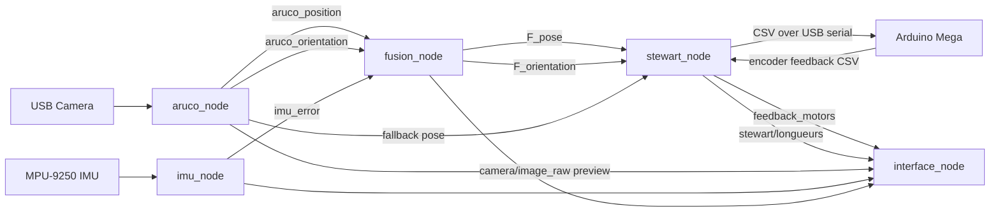
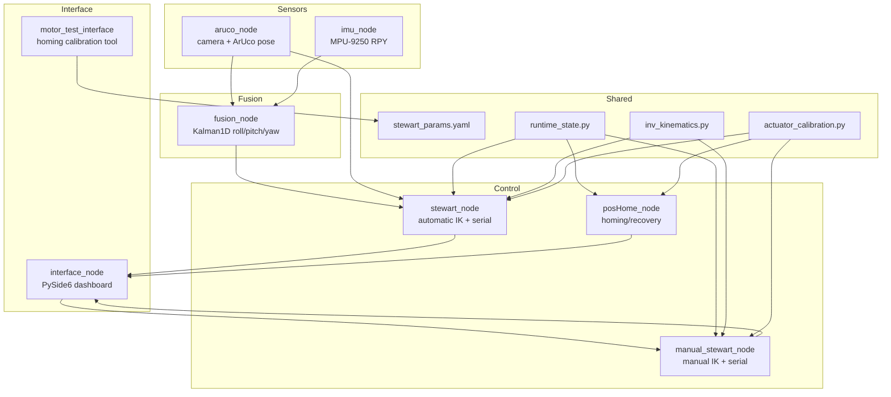
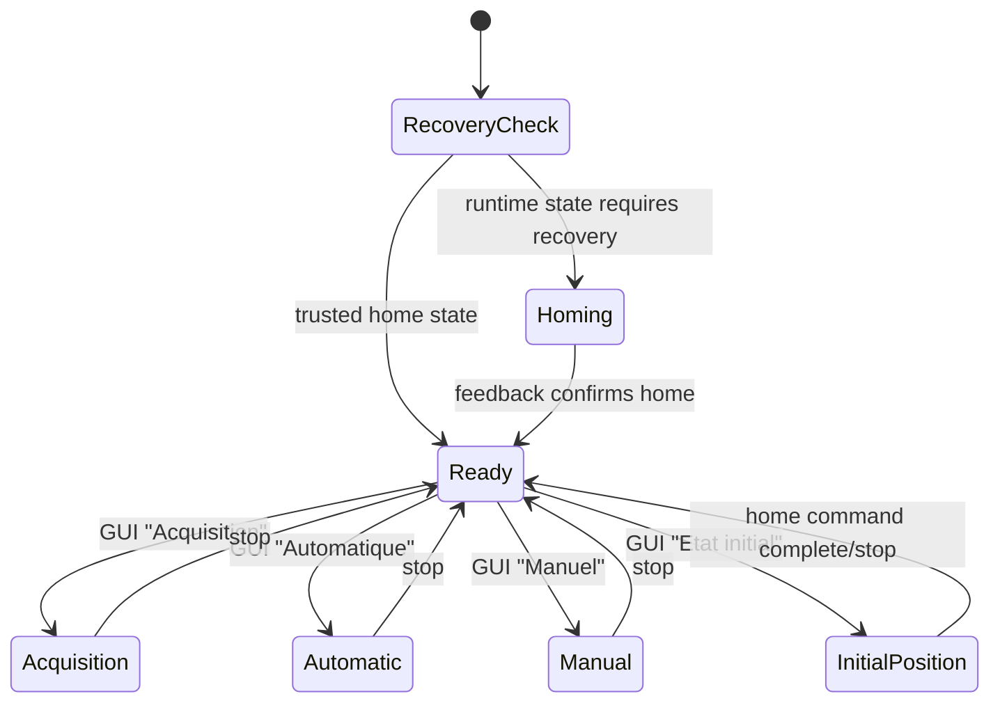
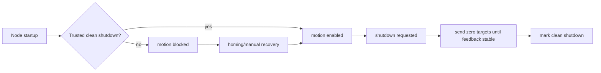

# Stewart Control

[](https://github.com/jbernardo6u/stewart-control_ws/actions/workflows/ci.yml)

ROS 2 control workspace for a Stewart platform with ArUco vision tracking, MPU-9250 IMU orientation sensing, Kalman-based sensor fusion, calibrated actuator stroke mapping, Arduino Mega motor control, and a PySide6 monitoring/control interface.

The project is designed for a Raspberry Pi + Arduino hardware stack where ROS nodes handle perception, fusion, safety, and command generation while the Arduino runs the low-level encoder/PID loop.

## Contents

- [System Overview](#system-overview)
- [Repository Layout](#repository-layout)
- [Hardware Stack](#hardware-stack)
- [Runtime Architecture](#runtime-architecture)
- [ROS Topics](#ros-topics)
- [Runtime Modes](#runtime-modes)
- [Configuration](#configuration)
- [Safety Model](#safety-model)
- [Arduino Protocol](#arduino-protocol)
- [Installation](#installation)
- [Build](#build)
- [Run](#run)
- [GUI Operation](#gui-operation)
- [Calibration and Validation](#calibration-and-validation)
- [Performance Monitoring](#performance-monitoring)
- [Tuning Guide](#tuning-guide)
- [Development Workflow](#development-workflow)
- [Troubleshooting](#troubleshooting)

## System Overview

The system closes the loop from vision and inertial sensing to calibrated six-actuator motion commands.



Core behavior:

- Camera detects the moving ArUco marker and publishes corrected position/orientation.
- IMU publishes corrected roll/pitch/yaw.
- Fusion combines IMU and fresh camera orientation and publishes fused pose.
- Automatic controller computes Stewart inverse kinematics and sends six actuator targets to Arduino.
- Arduino runs encoder/PID control and streams motor feedback.
- GUI displays camera, pose, fusion, motor commands, feedback, and plots.

## Repository Layout

```text
Autonomous-Coupling/
|-- README.md
|-- pyproject.toml
|-- run_demo.sh
|-- scripts/
|   |-- performance_monitor.py
|   `-- verify_sensor_calibration.py
|-- src/stewart_control/
|   |-- arduino/
|   |   `-- pilotage_feedback_mp.ino
|   |-- calibration/
|   |   |-- calibrate_camera_charuco.py
|   |   `-- calibrate_dual_imu.py
|   |-- config/
|   |   `-- stewart_params.yaml
|   |-- docs/
|   |   |-- ARCHITECTURE.md
|   |   |-- USER_MANUAL.md
|   |   `-- Manual Mode Architecture.md
|   |-- launch/
|   |   |-- acquisition_launch.py
|   |   |-- launch_posHome.py
|   |   |-- manual_launch.py
|   |   |-- stewart.launch.py
|   |   `-- stewart_ordered_launch.py
|   |-- share/stewart_control/
|   |   |-- calib_int.npz
|   |   |-- calib_ext3.npz
|   |   |-- calib1.json
|   |   |-- calib2.json
|   |   `-- calib_int_meta.json
|   |-- stewart_control/
|   |   |-- actuator_calibration.py
|   |   |-- aruco_node.py
|   |   |-- config_loader.py
|   |   |-- fusion_node.py
|   |   |-- fusion_utils.py
|   |   |-- imu_node.py
|   |   |-- interface_node.py
|   |   |-- inv_kinematics.py
|   |   |-- manual_stewart_node.py
|   |   |-- motor_test_interface.py
|   |   |-- posHome_node.py
|   |   |-- runtime_state.py
|   |   `-- stewart_node.py
|   |-- test/
|   |   |-- diagnose_camera_failure.py
|   |   |-- graphical_validation.py
|   |   |-- orientation_accuracy.py
|   |   |-- test_camera_feed.py
|   |   |-- test_realtime_dual_aruco.py
|   |   |-- test_single_marker_fixed_camera.py
|   |   `-- visual_response_time.py
|   `-- validation/
|       `-- validate_camera_calibration.py
|-- build/      # generated by colcon
|-- install/    # generated by colcon
`-- log/        # generated by colcon
```

Generated directories are ignored by Git and should not be edited as source of truth:

- `build/`
- `install/`
- `log/`

## Hardware Stack

| Component | Purpose | Current project assumptions |
|---|---|---|
| Raspberry Pi / Linux host | Runs ROS 2, OpenCV, GUI, sensor fusion | ROS 2 Jazzy, Python 3.12 |
| USB camera | ArUco marker detection | OpenCV `v4l2`, 640x480, 30 FPS requested |
| MPU-9250 IMU | Orientation sensing | I2C bus `1`, address `0x68` |
| Arduino Mega 2560 | Low-level motor controller | USB serial `/dev/ttyACM0`, 115200 baud |
| Six actuators + encoders | Stewart platform motion | 960 ticks/rev, 2 cm pulley diameter |
| Touch/display GUI | Operator control and monitoring | PySide6 + matplotlib |

## Runtime Architecture



### Node Responsibilities

| Node | File | Role |
|---|---|---|
| `imu_node` | `imu_node.py` | Reads MPU-9250, computes roll/pitch/yaw, applies reference and axis remap, publishes `imu_error`. |
| `aruco_node` | `aruco_node.py` | Captures camera frames, detects ArUco marker pose, applies reference/remap, smooths/deadbands, publishes pose and preview image. |
| `fusion_node` | `fusion_node.py` | Combines IMU and camera orientation with 1D Kalman filters and publishes fused orientation/pose. |
| `stewart_node` | `stewart_node.py` | Automatic control: consumes fused/camera pose, computes IK, maps actuator targets, sends serial commands, reads feedback. |
| `manual_stewart_node` | `manual_stewart_node.py` | Manual control: consumes GUI manual targets, computes IK, sends serial commands, reads feedback. |
| `posHome_node` | `posHome_node.py` | Sends home command until feedback confirms the platform is parked. |
| `interface_node` | `interface_node.py` | PySide6 dashboard; starts/stops runtime modes, publishes manual commands, displays sensor/motor data. |
| `motor_test_interface` | `motor_test_interface.py` | Manual actuator homing and calibration UI; writes actuator limits to YAML. |

## ROS Topics

| Topic | Type | Publisher | Subscriber(s) | Meaning |
|---|---|---|---|---|
| `/aruco_position` | `std_msgs/Float32MultiArray` | `aruco_node` | `fusion_node`, `stewart_node`, `interface_node` | Marker position `[x, y, z]` in meters after reference correction. |
| `/aruco_orientation` | `std_msgs/Float32MultiArray` | `aruco_node` | `fusion_node`, `stewart_node`, `interface_node` | Marker orientation `[roll, pitch, yaw]` in degrees. |
| `/camera/image_raw` | `sensor_msgs/Image` | `aruco_node` | `interface_node` | Preview frame for GUI only. Not used for fusion directly. |
| `/imu_error` | `std_msgs/Float32MultiArray` | `imu_node` | `fusion_node`, `interface_node` | Corrected IMU `[roll, pitch, yaw]` in degrees. |
| `/F_orientation` | `std_msgs/Float32MultiArray` | `fusion_node` | `stewart_node`, `interface_node` | Fused orientation `[roll, pitch, yaw]`. |
| `/F_position` | `std_msgs/Float32MultiArray` | `fusion_node` | optional monitoring | Fresh camera position forwarded by fusion. |
| `/F_pose` | `std_msgs/Float32MultiArray` | `fusion_node` | `stewart_node`, monitoring | `[x, y, z, roll, pitch, yaw]`. |
| `/stewart/longueurs` | `std_msgs/Float32MultiArray` | `stewart_node`, `manual_stewart_node` | `interface_node` | Six actuator command targets in centimeters. |
| `/feedback_motors` | `std_msgs/Float32MultiArray` | `stewart_node`, `manual_stewart_node`, `posHome_node` | `interface_node`, monitoring | Six measured actuator positions in centimeters. |
| `/stewart_status` | `std_msgs/String` | `stewart_node`, `manual_stewart_node` | `interface_node` | Operator status and limit messages. |
| `/manual_position` | `std_msgs/Float32MultiArray` | `interface_node` | `manual_stewart_node` | Manual translation command in centimeters. |
| `/manual_orientation` | `std_msgs/Float32MultiArray` | `interface_node` | `manual_stewart_node` | Manual orientation command in degrees. |

## Runtime Modes



| Mode | GUI action | Launch file | Nodes |
|---|---|---|---|
| Acquisition | `Acquisition` | `acquisition_launch.py` | `imu_node`, `aruco_node`, `fusion_node` |
| Automatic | `Automatique` | `stewart.launch.py` plus sensor stack if needed | `stewart_node` |
| Manual | `Manuel` | `manual_launch.py` | `manual_stewart_node` |
| Initial position | `Etat initial` | `manual_launch.py` then sends zero target | `manual_stewart_node` |
| Recovery / homing | `Recovery / Homing` | GUI tool or `launch_posHome.py` | `motor_test_interface` or `posHome_node` |

## Configuration

Main file:

```text
src/stewart_control/config/stewart_params.yaml
```

The loader searches in this order:

1. `STEWART_CONFIG` environment variable
2. Source package config: `src/stewart_control/config/stewart_params.yaml`
3. Installed package share config

Key sections:

| Section | Purpose |
|---|---|
| `stewart_platform` | Base radius, platform radius, gamma angles, home position, nominal `L0`. |
| `serial` | Arduino port, baudrate, timeout, startup delay. |
| `actuators` | Logical stroke range, per-motor min/max calibration, feedback period. |
| `aruco` | Camera settings, marker IDs, marker size, smoothing/deadbands, preview period. |
| `imu` | I2C bus/address, calibration JSON, axis remap, reference orientation. |
| `fusion` | Camera freshness timeout, orientation deadband, Kalman `q/r`. |
| `automatic_control` | Automatic control behavior, pose source, smoothing, command deadbands. |

### Camera vs Preview Rate

The camera preview rate and ArUco detection loop are intentionally separate:

```yaml
aruco:
  loop_rate: 0.03
  preview_publish_period: 0.15
```

- `loop_rate` controls how often `aruco_node` attempts detection and publishes pose.
- `preview_publish_period` controls only GUI image publishing.
- Slowing preview reduces GUI load without directly slowing fusion/control pose topics.

## Safety Model

Safety state is handled by `runtime_state.py`.

By default, motion is blocked unless the system trusts that the platform is referenced at home.

Runtime state file:

```text
~/.stewart_control/motor_runtime_state.json
```

Override directory:

```bash
export STEWART_RUNTIME_DIR=/custom/runtime/path
```

State behavior:

- Clean shutdown parks the platform at home and marks startup trusted.
- Unexpected process death marks recovery required.
- Automatic/manual nodes refuse motion if recovery is required.
- Homing or manual recovery can mark the platform safe again.



## Arduino Protocol

Firmware:

```text
src/stewart_control/arduino/pilotage_feedback_mp.ino
```

Serial settings:

```text
/dev/ttyACM0 @ 115200 baud
```

Command format from Raspberry Pi to Arduino:

```text
M1,M2,M3,M4,M5,M6\n
```

Example:

```text
0.12,0.08,0.10,0.05,0.07,0.11
```

Feedback format from Arduino to Raspberry Pi:

```text
F1,F2,F3,F4,F5,F6\n
```

The Arduino loop:

- Reads the latest six target positions in centimeters.
- Converts encoder ticks to centimeters.
- Runs one PID controller per actuator.
- Stops each motor inside tolerance.
- Streams six feedback positions roughly every 20 ms.

Important constants in firmware:

| Constant | Value | Meaning |
|---|---:|---|
| `ticksParTourSortie` | `960.0` | Encoder ticks per output revolution |
| `diametrePoulieCm` | `2.0` | Pulley diameter |
| `stopToleranceCm` | `0.10` | Motor stop tolerance |
| `restartToleranceCm` | `0.25` | Restart threshold |
| `Kp`, `Ki`, `Kd` | `45.0`, `0.02`, `1.5` | PID gains |

## Installation

### System Dependencies

Install ROS 2 Jazzy and source it:

```bash
source /opt/ros/jazzy/setup.bash
```

Install common Python/runtime dependencies:

```bash
python3 -m pip install --user numpy pyyaml pyserial PySide6 matplotlib opencv-contrib-python
```

Hardware-specific dependencies may also be required:

```bash
python3 -m pip install --user smbus2 imusensor
```

Depending on your Raspberry Pi environment, `smbus` may come from apt:

```bash
sudo apt install python3-smbus i2c-tools
```

Enable I2C if needed:

```bash
sudo raspi-config
```

Then check the IMU:

```bash
i2cdetect -y 1
```

## Build

From the workspace root:

```bash
cd Autonomous-Coupling
source /opt/ros/jazzy/setup.bash
colcon build --symlink-install --packages-select stewart_control
source install/setup.bash
```

If you are working from the outer workspace that already has `src/stewart_control`, run the same commands from that workspace root.

## Run

### GUI

```bash
source install/setup.bash
ros2 run stewart_control interface_node
```

### Acquisition Stack

```bash
source install/setup.bash
ros2 launch stewart_control acquisition_launch.py
```

### Automatic Control

Start acquisition first, then:

```bash
source install/setup.bash
ros2 launch stewart_control stewart.launch.py
```

For cleaner timing tests, reduce logs:

```bash
ros2 launch stewart_control stewart.launch.py --ros-args --log-level warn
```

### Manual Control

```bash
source install/setup.bash
ros2 launch stewart_control manual_launch.py
```

### Homing Node

```bash
source install/setup.bash
ros2 launch stewart_control launch_posHome.py
```

### Combined Runtime

```bash
source install/setup.bash
ros2 launch stewart_control stewart_ordered_launch.py
```

This launches IMU, ArUco, fusion, and automatic Stewart control together.

## GUI Operation

The GUI is implemented in PySide6 and provides:

- Sensor status cards for ArUco, IMU, and fusion.
- Live camera preview.
- Motor command and feedback display.
- Six motor plots.
- Manual position/orientation command input.
- Buttons for acquisition, automatic mode, manual mode, initial position, stop, recovery, and homing.

GUI mode buttons currently launch ROS processes using `subprocess.Popen`.

Important behavior:

- Automatic/manual modes are disabled if runtime recovery is required.
- Initial position starts manual control and sends a zero target.
- Recovery/homing opens the motor test interface.
- Stop sends `SIGINT` to launched process groups, then kills them if they do not exit.

## Calibration and Validation

### IMU Calibration

Interactive dual-IMU calibration:

```bash
python3 src/stewart_control/calibration/calibrate_dual_imu.py
```

It collects:

- Stationary gyro bias
- Six-face accelerometer means
- Magnetometer rotation samples

Outputs RTIMULib-style JSON files such as:

```text
src/stewart_control/share/stewart_control/calib1.json
src/stewart_control/share/stewart_control/calib2.json
```

### IMU Home Reference

```bash
python3 src/stewart_control/test/test_imu_home_reference.py
```

Use this to estimate `imu.reference_orientation_deg` while the platform is held at the desired home pose.

### Camera Intrinsic Calibration

```bash
python3 src/stewart_control/calibration/calibrate_camera_charuco.py
```

The script uses ChArUco board samples and writes:

```text
src/stewart_control/share/stewart_control/calib_int.npz
src/stewart_control/share/stewart_control/calib_int_meta.json
```

### Camera Calibration Validation

```bash
python3 src/stewart_control/validation/validate_camera_calibration.py
```

It reports reprojection error, coverage, pose stability, and a calibration rating.

### Camera / ArUco Diagnostics

Useful diagnostic scripts:

```bash
python3 src/stewart_control/test/test_camera_feed.py
python3 src/stewart_control/test/test_realtime_dual_aruco.py
python3 src/stewart_control/test/test_single_marker_fixed_camera.py
python3 src/stewart_control/test/diagnose_camera_failure.py
```

### Orientation and Response Validation

```bash
python3 src/stewart_control/test/orientation_accuracy.py
python3 src/stewart_control/test/visual_response_time.py
python3 src/stewart_control/test/graphical_validation.py
```

These scripts are hardware/diagnostic tools, not conventional CI unit tests.

## Performance Monitoring

Runtime monitor:

```text
scripts/performance_monitor.py
```

Run during a real test:

```bash
source install/setup.bash
python3 scripts/performance_monitor.py --duration 120
```

Outputs:

```text
performance_logs/performance_YYYYMMDD_HHMMSS.csv
performance_logs/performance_YYYYMMDD_HHMMSS_summary.json
```

Metrics include:

- CPU and memory for relevant ROS/node processes
- Topic rates
- Topic stale times
- Topic period average and p95
- Camera preview payload size
- Command-to-feedback timing

Healthy reference values from recent tests:

| Metric | Good target |
|---|---:|
| IMU | ~20 Hz |
| Feedback | 40-50 Hz |
| Fusion orientation | 25-30+ Hz |
| Fusion pose | close to ArUco/fresh camera availability |
| ArUco pose | 8-10 Hz usable, 15+ Hz better |
| Command-to-feedback p95 | under 50 ms |
| Camera preview | can be slower; GUI only |

## Tuning Guide

### ArUco Tracking

If tracking is not smooth:

1. Improve marker visibility and lighting.
2. Increase physical marker size.
3. Reduce camera resolution if CPU-bound.
4. Keep `single_marker_only: true` when using one moving marker.
5. Keep GUI preview slower than detection.
6. Avoid debug logging during control.

Relevant YAML:

```yaml
aruco:
  camera_width: 640
  camera_height: 480
  preview_publish_period: 0.15
  loop_rate: 0.03
  pose_alpha: 0.22
  position_deadband_m: 0.0015
  orientation_deadband_deg: 0.35
```

### GUI Load

The GUI can be CPU-heavy because it renders:

- Live camera preview
- Six matplotlib motor plots
- Sensor and motor labels

Current source setting:

```python
PLOT_UPDATE_INTERVAL_S = 0.25
```

For lower CPU, try `0.50` or add a plot-disable switch.

### Automatic Command Rate

The Arduino command rate is not fixed. `stewart_node` sends a new command only when:

- Fresh pose input changes enough
- IK output changes beyond `length_threshold`
- Command passes logical and physical actuator limits
- Command is outside `command_deadband_cm`
- Platform is outside `stop_tolerance_cm`

Relevant YAML:

```yaml
actuators:
  length_threshold: 0.08

automatic_control:
  stop_tolerance_cm: 1.0
  command_debounce_s: 0.002
  command_deadband_cm: 0.05
```

### Logging

Most high-frequency logs are `debug` and are safe unless debug logging is enabled.

For timing tests:

```bash
ros2 launch stewart_control stewart.launch.py --ros-args --log-level warn
```

Avoid running control nodes at debug level during real tracking.

## Development Workflow

Formatting and linting tools:

- Black
- flake8
- pre-commit
- clang-format for Arduino

Install hooks:

```bash
python3 -m pip install --user pre-commit black flake8
pre-commit install
```

Run checks:

```bash
pre-commit run --all-files
```

Compile-check Python:

```bash
python3 -m compileall -q src scripts
```

Build package:

```bash
source /opt/ros/jazzy/setup.bash
colcon build --symlink-install --packages-select stewart_control
```

## Troubleshooting

### The GUI Opens but Buttons Do Nothing

Check that ROS is sourced:

```bash
source install/setup.bash
which ros2
```

Check runtime recovery state. If recovery is required, automatic/manual motion is blocked until home is confirmed.

### Motion Is Blocked

Run homing or confirm recovery:

```bash
ros2 launch stewart_control launch_posHome.py
```

Or use the GUI recovery/homing tool.

### ArUco Rate Is Low

Check:

- Marker is visible during the entire test
- Lighting is strong
- Marker is not blurred
- Marker fills enough pixels
- Camera exposure is not causing motion blur
- CPU is not saturated by GUI plotting

Use:

```bash
python3 scripts/performance_monitor.py --duration 60
```

### Camera Stalls

Run:

```bash
python3 src/stewart_control/test/diagnose_camera_failure.py
```

Check for:

- Another process using `/dev/video0`
- USB/V4L2 kernel warnings
- Slow OpenCV reads
- Exposure mode problems

### Serial Port Fails

Check:

```bash
ls -l /dev/ttyACM*
groups
```

If needed:

```bash
sudo usermod -aG dialout "$USER"
```

Then log out and back in.

### Installed Code Does Not Match Source

Rebuild and source again:

```bash
colcon build --symlink-install --packages-select stewart_control
source install/setup.bash
```

Check which executable is being used:

```bash
ros2 pkg prefix stewart_control
```

## License

Apache-2.0. See [LICENSE](LICENSE).

## Maintainer

Package maintainer in metadata:

```text
Jbantu <jbantu@example.com>
```
