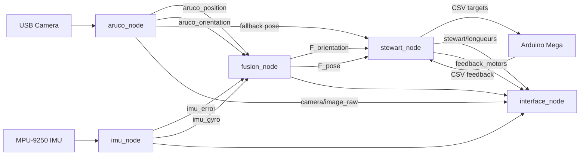

# Stewart Control

ROS 2 workspace for a six-actuator Stewart platform with ArUco vision tracking,
MPU-9250 inertial sensing, gyro-assisted sensor fusion, calibrated actuator
stroke mapping, Arduino Mega motor control, and a PySide6 operator interface.

The system is built for a Raspberry Pi or Linux host connected to an Arduino
Mega. ROS nodes handle perception, fusion, runtime state, inverse kinematics,
operator UI, and command generation. The Arduino handles low-level encoder
feedback and motor PWM output.

## Project Objectives

- Automatically align and position a Stewart platform for precise physical
  coupling or docking tasks.
- Track the platform in real time using both camera vision and inertial sensing,
  so the system can understand how the platform is moving in the real world.
- Keep the platform stable when the target is steady, while still responding
  quickly when real motion occurs.
- Let an operator switch between monitoring, automatic movement, manual control,
  and homing from one interface.
- Show the live camera feed, sensor readings, motor commands, and motor feedback
  clearly enough for testing, tuning, and operation.
- Protect the mechanism by respecting actuator travel limits and requiring a
  trusted home position before motion after an unsafe shutdown.
- Provide calibration and validation tools so camera, IMU, and actuator behavior
  can be checked before real platform operation.

## Current Capabilities

- Single USB camera ArUco tracking with configurable marker IDs, camera
  controls, pose smoothing, pose deadbands, and watchdog recovery.
- Single MPU-9250 IMU orientation publishing with axis remap, reference offset,
  calibration JSON loading, and gyro-rate publishing.
- Fusion node with angle-rate Kalman filtering, separate IMU/camera/gyro trust
  values, camera outlier rejection, and fused pose publishing.
- Automatic Stewart controller using fused pose when available, camera fallback
  when required, IK-based actuator targets, command smoothing, command
  deadbands, and per-motor soft-limit mapping.
- Manual Stewart controller receiving GUI translation/orientation targets.
- Runtime-state safety file that blocks motion after unclean shutdowns until
  home is confirmed.
- PySide6 dashboard with live camera preview, status LEDs, sensor values, motor
  commands, feedback, plots, runtime controls, and homing/calibration access.
- Arduino firmware with encoder-based position feedback, stop/restart
  hysteresis, PWM ramping, and CSV serial protocol.

## Repository Layout

```text
Autonomous-Coupling/
|-- README.md
|-- pyproject.toml
|-- run_demo.sh
|-- scripts/
|   |-- performance_monitor.py
|   `-- verify_sensor_calibration.py
|-- src/stewart_control/
|   |-- arduino/
|   |   `-- pilotage_feedback_mp.ino
|   |-- calibration/
|   |   |-- calibrate_camera_charuco.py
|   |   `-- calibrate_dual_imu.py
|   |-- config/
|   |   `-- stewart_params.yaml
|   |-- docs/
|   |-- launch/
|   |-- share/stewart_control/
|   |-- stewart_control/
|   |   |-- actuator_calibration.py
|   |   |-- aruco_node.py
|   |   |-- config_loader.py
|   |   |-- fusion_node.py
|   |   |-- fusion_utils.py
|   |   |-- imu_node.py
|   |   |-- interface_node.py
|   |   |-- inv_kinematics.py
|   |   |-- manual_stewart_node.py
|   |   |-- motor_test_interface.py
|   |   |-- posHome_node.py
|   |   |-- runtime_state.py
|   |   `-- stewart_node.py
|   |-- test/
|   `-- validation/
|-- build/      # generated by colcon
|-- install/    # generated by colcon
`-- log/        # generated by colcon
```

Generated `build/`, `install/`, and `log/` directories are not source of truth.
Edit files under `src/stewart_control`.

## Hardware Assumptions

| Component | Purpose | Current assumption |
|---|---|---|
| Linux host / Raspberry Pi | Runs ROS 2, OpenCV, GUI, fusion, control | ROS 2 Jazzy, Python 3.12 |
| USB camera | ArUco marker tracking and GUI preview | V4L2, 640x480, 30 FPS requested |
| MPU-9250 IMU | Orientation and gyro-rate measurement | I2C bus `1`, address `0x68` |
| Arduino Mega 2560 | Low-level motor/encoder controller | `/dev/ttyACM0`, 115200 baud |
| Six actuators + encoders | Stewart platform motion | 960 ticks/rev, 2 cm pulley diameter |
| Operator display | GUI control and monitoring | PySide6 + matplotlib |

## System Architecture



## Node Responsibilities

| Node | File | Responsibility |
|---|---|---|
| `aruco_node` | `aruco_node.py` | Opens camera, detects ArUco marker pose, applies camera reference/remap, stabilizes pose, publishes pose and preview image. |
| `imu_node` | `imu_node.py` | Reads MPU-9250, computes corrected RPY, applies reference/remap, publishes orientation and gyro rate. |
| `fusion_node` | `fusion_node.py` | Fuses IMU angle, gyro rate, and camera angle with an angle-rate Kalman filter and camera outlier rejection. |
| `stewart_node` | `stewart_node.py` | Automatic control: selects fused/camera pose, filters control pose, computes IK, maps calibrated strokes, sends Arduino targets, reads feedback. |
| `manual_stewart_node` | `manual_stewart_node.py` | Manual control: consumes GUI targets, computes IK, sends Arduino targets, reads feedback. |
| `posHome_node` | `posHome_node.py` | Sends home targets until feedback confirms a stable home position. |
| `interface_node` | `interface_node.py` | PySide6 GUI, mode/process control, camera preview, telemetry, manual target publishing, motor plots. |
| `motor_test_interface` | `motor_test_interface.py` | Manual actuator homing/calibration tool that writes actuator limits to YAML. |

## ROS Topics

| Topic | Type | Publisher | Subscribers | Meaning |
|---|---|---|---|---|
| `/aruco_position` | `std_msgs/Float32MultiArray` | `aruco_node` | `fusion_node`, `stewart_node`, `interface_node` | Marker position `[x, y, z]` in meters after camera reference correction. |
| `/aruco_orientation` | `std_msgs/Float32MultiArray` | `aruco_node` | `fusion_node`, `stewart_node`, `interface_node` | Marker orientation `[roll, pitch, yaw]` in degrees. |
| `/camera/image_raw` | `sensor_msgs/Image` | `aruco_node` | `interface_node` | GUI preview image. Not used directly for fusion. |
| `/imu_error` | `std_msgs/Float32MultiArray` | `imu_node` | `fusion_node`, `interface_node` | Corrected IMU orientation `[roll, pitch, yaw]` in degrees. |
| `/imu_gyro` | `std_msgs/Float32MultiArray` | `imu_node` | `fusion_node`, monitoring | Gyro angular rate `[roll_rate, pitch_rate, yaw_rate]` in deg/s by default. |
| `/F_orientation` | `std_msgs/Float32MultiArray` | `fusion_node` | `stewart_node`, `interface_node` | Fused orientation `[roll, pitch, yaw]` in degrees. |
| `/F_position` | `std_msgs/Float32MultiArray` | `fusion_node` | monitoring | Fresh camera position forwarded by fusion. |
| `/F_pose` | `std_msgs/Float32MultiArray` | `fusion_node` | `stewart_node`, monitoring | `[x, y, z, roll, pitch, yaw]`. Published only while camera pose is fresh. |
| `/stewart/longueurs` | `std_msgs/Float32MultiArray` | `stewart_node`, `manual_stewart_node` | `interface_node` | Six actuator command targets in centimeters. |
| `/feedback_motors` | `std_msgs/Float32MultiArray` | `stewart_node`, `manual_stewart_node`, `posHome_node` | `interface_node`, monitoring | Six measured actuator positions in centimeters. |
| `/stewart_status` | `std_msgs/String` | `stewart_node`, `manual_stewart_node` | `interface_node` | Operator status and limit messages. |
| `/manual_position` | `std_msgs/Float32MultiArray` | `interface_node` | `manual_stewart_node` | Manual translation command in centimeters. |
| `/manual_orientation` | `std_msgs/Float32MultiArray` | `interface_node` | `manual_stewart_node` | Manual orientation command in degrees. |

## Runtime Modes

| Mode | GUI button | Launch file / action | Notes |
|---|---|---|---|
| Acquisition | `Acquisition` | `acquisition_launch.py` | Starts IMU, ArUco, and fusion only. Used for tracking/preview without platform motion. |
| Automatic | `Automatique` | `stewart.launch.py` plus sensor stack if needed | Starts automatic IK/serial control. Motion is blocked if recovery is required. |
| Manual | `Manuel` | `manual_launch.py` | Enables GUI manual pose commands. |
| Initial position | `Etat initial` | `manual_launch.py` then zero command | Sends a zero pose target through manual control. |
| Recovery / Homing | `Recovery / Homing` | `motor_test_interface` or `launch_posHome.py` | Confirms or recalibrates actuator home state. |

## Configuration

Main configuration file:

```text
src/stewart_control/config/stewart_params.yaml
```

`config_loader.py` resolves configuration in this order:

1. `STEWART_CONFIG`
2. Source package config
3. Installed package share config

Key sections:

| Section | Purpose |
|---|---|
| `stewart_platform` | Platform geometry and nominal home length `L0`. |
| `serial` | Arduino port, baudrate, timeout, startup delay. |
| `actuators` | Logical stroke, calibrated per-motor min/max, feedback timer, command threshold. |
| `aruco` | Camera settings, marker IDs, reference pose, pose smoothing, preview rate, watchdog timeout. |
| `imu` | I2C address, calibration JSON, axis remap, reference orientation, gyro publishing. |
| `fusion` | Gyro prediction, camera timeout, Kalman noise values, outlier thresholds, hold deadband. |
| `automatic_control` | Fused-pose usage, smoothing, deadbands, command debounce, stop tolerance. |

### Fusion Tuning Notes

The fusion node uses an angle-rate Kalman filter per axis.

| Parameter | Meaning |
|---|---|
| `process_angle_q` | Larger values allow angle estimate to move more freely. |
| `process_rate_q` | Larger values allow faster response to real tilt changes. |
| `gyro_r` | Lower values trust gyro rate more. |
| `imu_r` | Lower values trust IMU angle more. |
| `camera_r` | Lower values trust camera angle more. |
| `outlier_threshold_deg` | Camera/angle jump threshold before rejection. |
| `orientation_hold_deadband_deg` | Holds very small fused angle changes to avoid rest jitter. |

Current design intent:

- Roll/pitch respond relatively quickly.
- Yaw is treated more conservatively because magnetometer yaw is easily affected
  by motors, metal, wiring, and current.
- Camera outliers are rejected before they can move the platform.
- Gyro rate improves tilt response without replacing absolute angle correction.

If the fused response is too slow, increase `process_rate_q` slightly for the
affected axis. If it jitters at rest, increase that axis measurement noise or
the hold/deadband values slightly.

### Camera Preview and GUI Load

Camera detection and GUI preview are intentionally separate:

```yaml
aruco:
  loop_rate: 0.03
  preview_width: 320
  preview_height: 240
  preview_publish_period: 0.05
```

- `loop_rate` controls pose detection attempts.
- `preview_publish_period` controls only GUI image publishing.
- The GUI renders the newest camera frame at about 20 FPS and drops older
  frames to avoid display lag.
- Motor labels update at a moderate rate and six matplotlib plots are refreshed
  less often so automatic mode does not block camera preview.

## Runtime Safety Model

Runtime state is handled by `runtime_state.py`.

Default state file:

```text
~/.stewart_control/motor_runtime_state.json
```

Override directory:

```bash
export STEWART_RUNTIME_DIR=/custom/runtime/path
```

Behavior:

- Motion starts only if the previous session ended cleanly at home.
- Unexpected process death or failed shutdown marks recovery required.
- Automatic/manual nodes refuse motion while recovery is required.
- Homing or manual recovery can mark home as confirmed.
- Shutdown attempts to park the platform at home before marking the state clean.

## Arduino Protocol and Motor Control

Firmware:

```text
src/stewart_control/arduino/pilotage_feedback_mp.ino
```

Serial settings:

```text
/dev/ttyACM0 @ 115200 baud
```

Command from Raspberry Pi to Arduino:

```text
M1,M2,M3,M4,M5,M6\n
```

Feedback from Arduino to Raspberry Pi:

```text
F1,F2,F3,F4,F5,F6\n
```

The firmware currently:

- Reads six target positions in centimeters.
- Converts encoder ticks to centimeters.
- Applies stop/restart hysteresis near target.
- Uses PWM ramping to reduce abrupt motor changes.
- Streams six feedback positions roughly every 20 ms.

Important note: the firmware creates PID controller objects and calls
`Compute()`, but the current PWM output is still based on a custom
error-to-PWM rule with ramping. Treat the current firmware as encoder feedback
control with proportional-style PWM behavior. If true PID output is adopted
later, it should be tested one actuator at a time before running all six under
platform load.

## Installation

Source ROS 2:

```bash
source /opt/ros/jazzy/setup.bash
```

Install common Python dependencies:

```bash
python3 -m pip install --user numpy pyyaml pyserial PySide6 matplotlib opencv-contrib-python
```

Install hardware-specific dependencies as needed:

```bash
python3 -m pip install --user smbus2 imusensor
sudo apt install python3-smbus i2c-tools
```

Enable I2C on Raspberry Pi if required, then verify:

```bash
i2cdetect -y 1
```

## Build

From the workspace root:

```bash
cd Autonomous-Coupling
source /opt/ros/jazzy/setup.bash
colcon build --symlink-install --packages-select stewart_control
source install/setup.bash
```

After source changes, rebuild and source again before running. The installed
entry points under `install/` are what `ros2 run` and `ros2 launch` execute.

## Run

### GUI

```bash
source install/setup.bash
ros2 run stewart_control interface_node
```

### Acquisition

```bash
source install/setup.bash
ros2 launch stewart_control acquisition_launch.py
```

### Automatic Control

Start acquisition first, then:

```bash
source install/setup.bash
ros2 launch stewart_control stewart.launch.py
```

The GUI can start the sensor stack automatically when entering automatic mode.

### Manual Control

```bash
source install/setup.bash
ros2 launch stewart_control manual_launch.py
```

### Homing

```bash
source install/setup.bash
ros2 launch stewart_control launch_posHome.py
```

### Combined Launch

```bash
source install/setup.bash
ros2 launch stewart_control stewart_ordered_launch.py
```

## Verification Checklist

Before a real motion test, verify topic rates:

```bash
ros2 topic hz /camera/image_raw
ros2 topic hz /aruco_position
ros2 topic hz /imu_error
ros2 topic hz /imu_gyro
ros2 topic hz /F_orientation
ros2 topic hz /F_pose
ros2 topic hz /feedback_motors
```

Expected rough targets:

| Topic | Healthy target |
|---|---:|
| `/camera/image_raw` | about 15-20 Hz preview |
| `/aruco_position` | marker-dependent, ideally 15+ Hz |
| `/imu_error` | about 20 Hz with current config |
| `/imu_gyro` | about 20 Hz with current config |
| `/F_orientation` | about IMU/fusion rate |
| `/F_pose` | follows fresh camera pose availability |
| `/feedback_motors` | about 40-50 Hz |

During motor tests, compare:

```text
error_cm = command_cm - feedback_cm
```

Encoder feedback confirms motor/pulley rotation. Physical validation with a
ruler or caliper is still required to confirm that encoder distance equals real
actuator travel.

## Calibration and Validation

### IMU Calibration

```bash
python3 src/stewart_control/calibration/calibrate_dual_imu.py
```

Collects stationary gyro bias, six-face accelerometer data, and magnetometer
samples. Calibration JSON files are stored under:

```text
src/stewart_control/share/stewart_control/
```

### IMU Home Reference

```bash
python3 src/stewart_control/test/test_imu_home_reference.py
```

Use this with the platform in home pose to estimate
`imu.reference_orientation_deg`.

### Camera Intrinsic Calibration

```bash
python3 src/stewart_control/calibration/calibrate_camera_charuco.py
```

Writes:

```text
src/stewart_control/share/stewart_control/calib_int.npz
src/stewart_control/share/stewart_control/calib_int_meta.json
```

### Camera Calibration Validation

```bash
python3 src/stewart_control/validation/validate_camera_calibration.py
```

### Camera Diagnostics

```bash
python3 src/stewart_control/test/test_camera_feed.py
python3 src/stewart_control/test/test_single_marker_fixed_camera.py
python3 src/stewart_control/test/test_realtime_dual_aruco.py
python3 src/stewart_control/test/diagnose_camera_failure.py
```

### Orientation and Response Diagnostics

```bash
python3 src/stewart_control/test/orientation_accuracy.py
python3 src/stewart_control/test/visual_response_time.py
python3 src/stewart_control/test/graphical_validation.py
```

These scripts are hardware diagnostics and validation tools, not conventional
unit tests.

## Performance Monitoring

Run:

```bash
source install/setup.bash
python3 scripts/performance_monitor.py --duration 120
```

Outputs:

```text
performance_logs/performance_YYYYMMDD_HHMMSS.csv
performance_logs/performance_YYYYMMDD_HHMMSS_summary.json
```

The monitor tracks ROS topic rates, stale times, process CPU/memory, command to
feedback latency, camera preview payloads, and `/imu_gyro`.

## Tuning Guidance

### Sensor Stability

- Keep camera exposure/focus stable.
- Use strong lighting and a rigid marker mount.
- Increase physical marker size when possible.
- Keep the IMU away from motors, power wires, and ferromagnetic material.
- Expect yaw to be less reliable than roll/pitch around motors.

### Fusion

- Increase `process_rate_q` for faster real tilt response.
- Increase `gyro_r` if gyro prediction makes the estimate too reactive.
- Increase `imu_r` or `camera_r` if that sensor is noisy.
- Increase `orientation_hold_deadband_deg` only enough to stop rest jitter.

### Automatic Control

The controller sends a new command only when:

- pose input is fresh enough,
- IK output changes beyond `length_threshold`,
- logical and physical actuator limits pass,
- command difference exceeds `command_deadband_cm`,
- platform is outside `stop_tolerance_cm`.

Avoid adding heavy restrictions before measuring topic rates, CPU load, and
command-to-feedback timing.

### GUI Smoothness

The GUI is optimized to keep camera preview smooth during automatic mode:

- image callbacks store only the latest frame,
- camera render runs on a timer,
- motor data callbacks store latest values,
- motor labels and plots are refreshed on timers.

If CPU is still high, reduce preview rate before reducing tracking rate:

```yaml
aruco:
  preview_publish_period: 0.075
```

## Troubleshooting

### Installed Code Does Not Match Source

Rebuild and source:

```bash
colcon build --symlink-install --packages-select stewart_control
source install/setup.bash
```

Check package location:

```bash
ros2 pkg prefix stewart_control
```

### Motion Is Blocked

Runtime recovery is required. Run homing or confirm home through the GUI:

```bash
ros2 launch stewart_control launch_posHome.py
```

### Camera Feed Stalls or ArUco Pose Is Stale

Check:

- marker ID and visibility,
- lighting and focus,
- USB cable/port,
- another process using the camera,
- OpenCV/V4L2 read delays.

Run:

```bash
python3 src/stewart_control/test/diagnose_camera_failure.py
```

### Serial Port Fails

Check:

```bash
ls -l /dev/ttyACM*
groups
```

If needed:

```bash
sudo usermod -aG dialout "$USER"
```

Log out and back in after changing groups.

### Orientation Is Stable but Platform Still Moves

Check command and feedback:

```bash
ros2 topic echo /stewart/longueurs
ros2 topic echo /feedback_motors
```

If commands are stable but feedback moves, inspect Arduino/motor wiring,
encoder direction, mechanical slip, and actuator calibration. If commands are
moving, inspect `/F_pose`, fusion tuning, and automatic-control deadbands.

## Development

Formatting and checks:

```bash
python3 -m compileall -q src scripts
python3 -m pip install --user black flake8 pre-commit
pre-commit run --all-files
```

Build:

```bash
source /opt/ros/jazzy/setup.bash
colcon build --symlink-install --packages-select stewart_control
```

## License

Apache-2.0. See [LICENSE](LICENSE).
