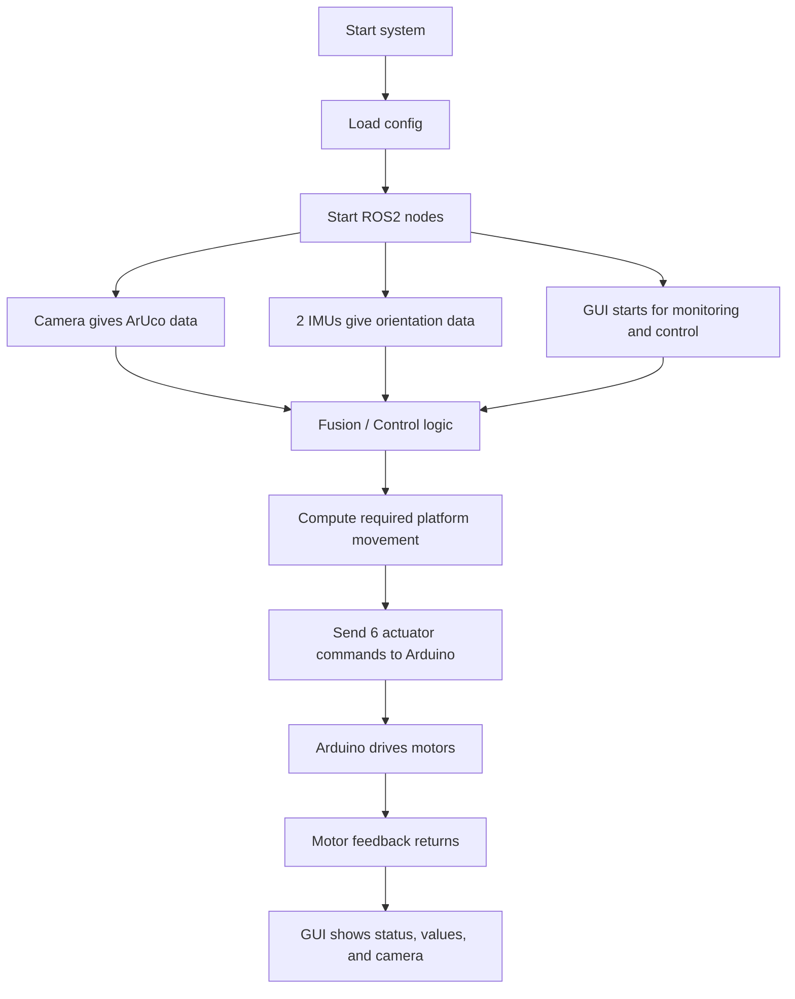
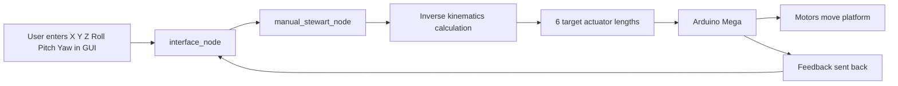
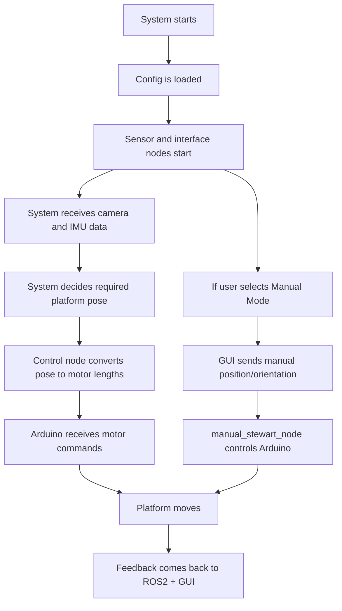

# Project Architecture

## Full System - General Flow

```mermaid
flowchart TD
    A[Start system] --> B[Load config]
    B --> C[Start ROS2 nodes]

    C --> D[Camera gives ArUco data]
    C --> E[2 IMUs give orientation data]
    C --> F[GUI starts for monitoring and control]

    D --> G[Fusion / Control logic]
    E --> G
    F --> G

    G --> H[Compute required platform movement]
    H --> I[Send 6 actuator commands to Arduino]
    I --> J[Arduino drives motors]
    J --> K[Motor feedback returns]
    K --> L[GUI shows status, values, and camera]
```

## Manual Mode

```mermaid
flowchart LR
    A[User enters X Y Z Roll Pitch Yaw in GUI]
    A --> B[interface_node]
    B --> C[manual_stewart_node]
    C --> D[Inverse kinematics calculation]
    D --> E[6 target actuator lengths]
    E --> F[Arduino Mega]
    F --> G[Motors move platform]
    F --> H[Feedback sent back]
    H --> B
```

## What Happens When

```mermaid
flowchart TD
    A[System starts] --> B[Config is loaded]
    B --> C[Sensor and interface nodes start]
    C --> D[System receives camera and IMU data]
    D --> E[System decides required platform pose]
    E --> F[Control node converts pose to motor lengths]
    F --> G[Arduino receives motor commands]
    G --> H[Platform moves]
    H --> I[Feedback comes back to ROS2 + GUI]

    C --> J[If user selects Manual Mode]
    J --> K[GUI sends manual position/orientation]
    K --> L[manual_stewart_node controls Arduino]
    L --> H
```
